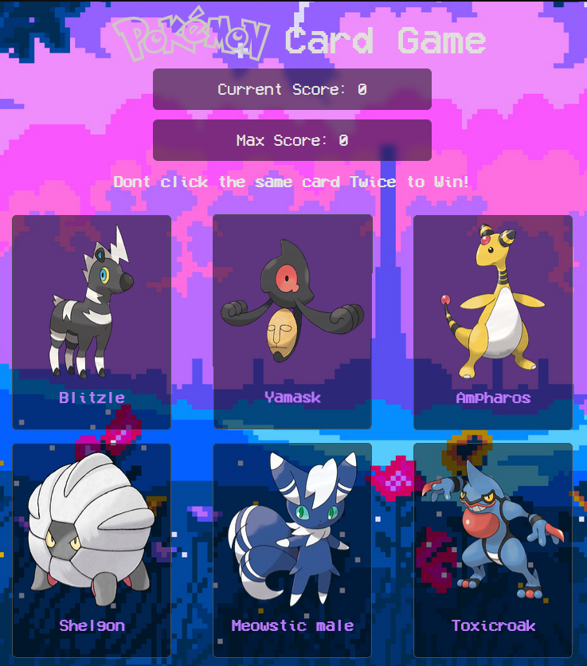

# Memory Card Game - Pokémon Edition

  <a href="https://matalvarez10.github.io/Memory-Card/" style="font-size: 32px;">Live Preview of the Project</a>

## Overview

The Memory Card Game - Pokémon Edition is an engaging web-based game built using React, TypeScript, and styled with Tailwind CSS. In this game, players are presented with a grid of Pokémon cards, and their objective is to uncover all the cards without clicking the same card twice during a set number of turns. After each turn, the cards are shuffled and repositioned, challenging players to exercise their memory and strategy skills while enjoying a Pokémon-themed experience.

## Features

- **Pokémon Cards**: The game features Pokémon card images fetched from the PokeAPI, offering a wide array of Pokémon to uncover.

- **Turn-Based Gameplay**: Players have a limited number of turns to uncover all the cards without clicking the same card twice.

- **Card Shuffling**: After each turn, the cards are shuffled and repositioned, increasing the challenge.

- **Move Counter**: The game keeps track of the number of moves taken to uncover all the cards.

- **Responsive Design**: The game is designed for playability on both desktop and mobile devices.

## Technologies Used

- **React**: The core framework for building the game's user interface.

- **TypeScript**: Enhances code quality and helps prevent runtime errors.

- **Tailwind CSS**: A utility-first CSS framework for responsive and visually appealing styling.

- **PokeAPI**: Used to fetch Pokémon images for the game cards.

## Getting Started

To play the Memory Card Game - Pokémon Edition, follow these steps:

1. Clone the repository to your local machine.

2. Navigate to the project directory.

3. Install the required dependencies with `npm install` or `yarn install`.

4. Start the development server using `npm start` or `yarn start`.

5. Open your web browser and access the game at `http://localhost:3000`.
